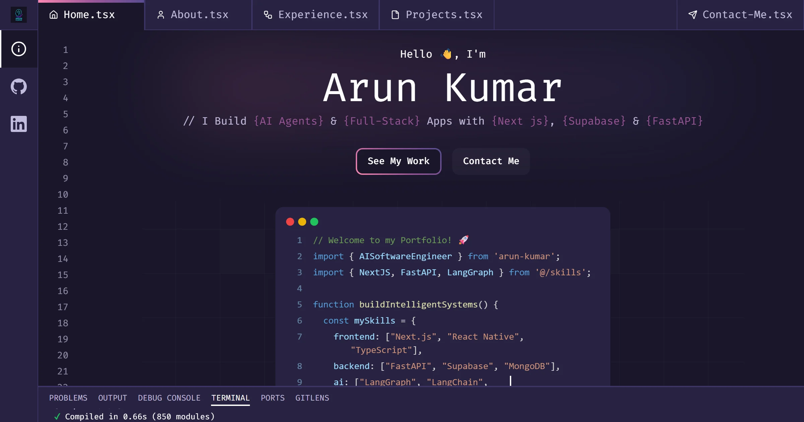

# Arun Kumar — Portfolio

Personal portfolio of Arun Kumar, AI Software Engineer. Built with Next.js 16 and React 19, with an AI chat assistant (Gemini) that answers questions about my work from the same data that renders the site.



## Features

- 🤖 **AI chat assistant** — Gemini 2.5 Flash, grounded in `data/` so answers match the page
- ⌨️ **Code-typing hero** — animated snippet with Prism syntax highlighting
- 🗂️ **Projects** — CreativeOS, KittyKat, Yuvabe ATS, TripKnot (App Store / Play Store links), Auromix
- 🧭 **Experience timeline**, technologies marquee, and a contact form (Resend)
- 🌙 Dark theme, responsive, framer-motion + Lottie animations

## Tech stack

| Area | Choice |
|---|---|
| Framework | Next.js 16 (App Router), React 19, TypeScript |
| Styling | Tailwind CSS 3, shadcn/ui, Lucide icons |
| Animation | framer-motion, lottie-react |
| Forms | react-hook-form + zod |
| AI | `@google/genai` (gemini-2.5-flash) |
| Email | Resend |
| Package manager | pnpm |

## Getting started

```bash
pnpm install
cp .env.example .env.local   # fill in the keys below
pnpm dev                     # http://localhost:3000
```

### Environment variables

| Variable | Purpose |
|---|---|
| `GEMINI_API_KEY` | Chat assistant — https://aistudio.google.com/apikey |
| `RESEND_API_KEY` | Contact form — https://resend.com/api-keys |
| `NEXT_PUBLIC_SITE_URL` | Deployed URL, used for SEO / OpenGraph metadata |

The site builds and runs without any of these set; the chat and contact form return a 503 until their key is provided.

### Scripts

| Command | What it does |
|---|---|
| `pnpm dev` | Dev server |
| `pnpm build` | Production build |
| `pnpm start` | Serve the production build |
| `pnpm lint` | ESLint (flat config, `eslint-config-next`) |

## Where the content lives

| What | File |
|---|---|
| Hero tagline, social links, projects, technologies, contact | `data/index.ts` |
| Experience timeline | `data/experience.ts` |
| About copy | `components/sections/about/index.tsx` |
| Hero code snippet | `components/sections/home/code-typing.tsx` |
| SEO metadata | `app/layout.tsx` |
| Chat assistant context | `app/api/chat/route.ts` (generated from the files above) |

Hero tagline styling: words prefixed with `#` are highlighted; `_` becomes a space and `__` a dash.

Project screenshots go in `public/projects-imgs/`, skill icons in `public/skills/` (SVG, white or colour — the site is dark-themed). Project cards accept optional `githubLink`, `appStoreLink` and `playStoreLink` fields.

## License

MIT — see [LICENSE](LICENSE).
